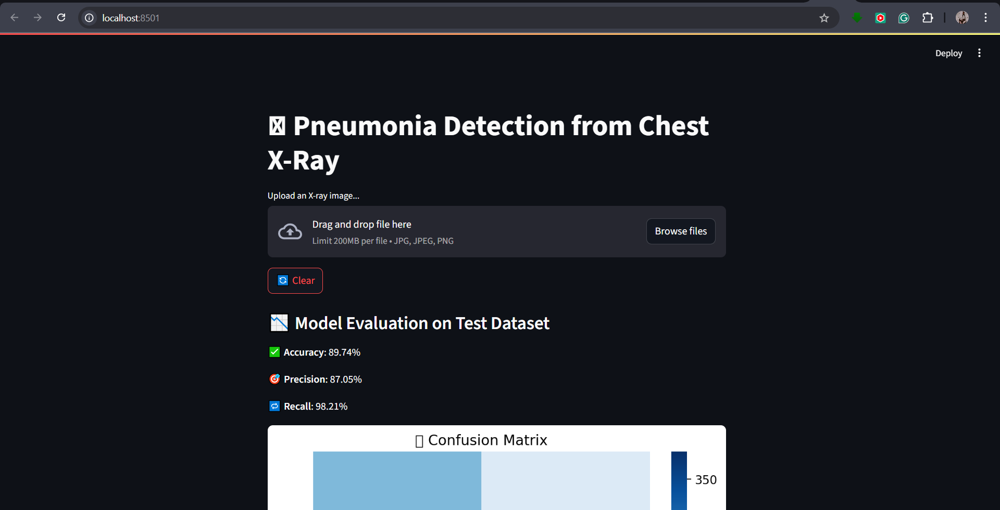
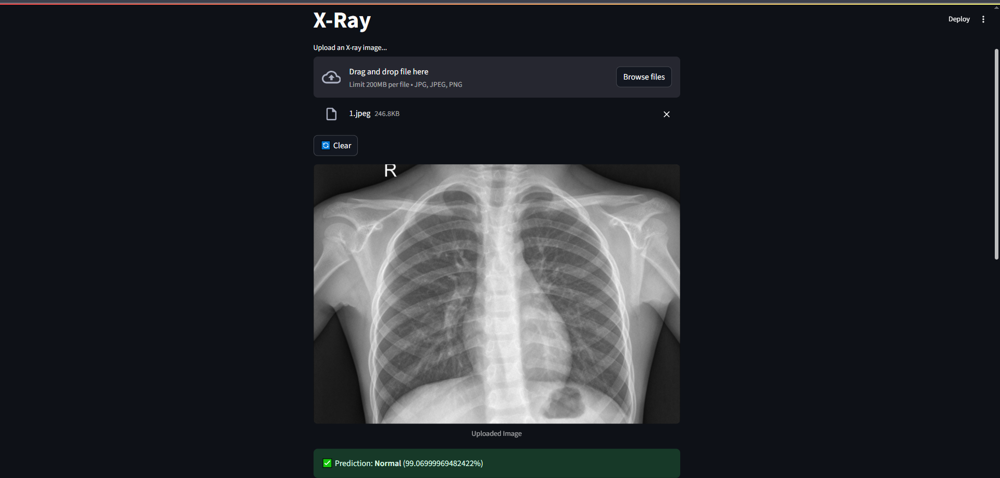
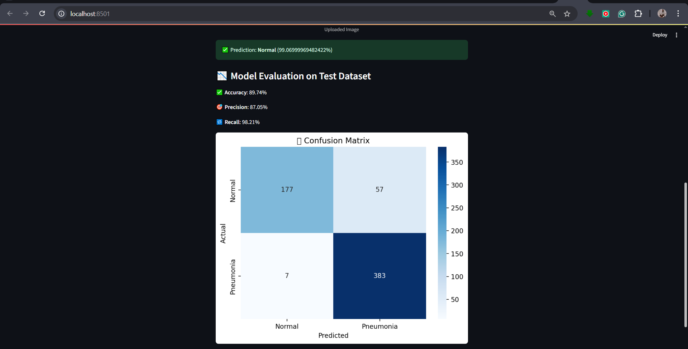

# 🩺 Pneumonia Detector - AI Powered Chest X-ray Classification App

This project is an AI-powered web app that detects **Pneumonia** from chest X-ray images using a trained **Convolutional Neural Network (CNN)**. Built with **Streamlit**, the app allows users to upload an X-ray image and instantly receive a prediction with confidence scores.

---

## 🚀 Features

- 🔍 Classifies chest X-rays as **Normal** or **Pneumonia**
- 📊 Displays prediction probability/confidence
- 📈 Evaluation metrics: accuracy, precision, recall, F1 score
- 📉 Confusion matrix with visualization
- 🖼️ Upload image preview
- ✅ Clean, minimal UI using **Streamlit**

---

## 🛠️ Tech Stack

| Layer         | Stack Used                       |
|---------------|----------------------------------|
| Model         | TensorFlow, Keras (CNN)          |
| Preprocessing | OpenCV, Pillow, NumPy            |
| Evaluation    | scikit-learn, matplotlib, seaborn|
| UI            | Streamlit                        |
| Development   | VS Code, Git, Google Colab       |

---

## 📂 Folder Structure
```
pneumonia-detector/
├── app.py                # Streamlit app main file
├── model/                # Trained CNN model (e.g. model.h5)
├── utils.py              # Helper functions (e.g. preprocessing)
├── requirements.txt
├── screenshots/          # UI image previews
│   ├── upload.png
│   ├── prediction.png
│   └── metrics.png
└── README.md
```

---

## ⚙️ Getting Started

### 📌 Prerequisites
- Python 3.8+
- pip

### 📥 1. Clone this Repository
```bash
git clone https://github.com/1YUVARAJ1/pneumonia-detector.git
cd pneumonia-detector
```

### 📦 2. Install Dependencies
```bash
pip install -r requirements.txt
```

### 🚀 3. Run the App
```bash
streamlit run app.py
```
Open your browser: [http://localhost:8501](http://localhost:8501)

---

## 🖼️ Screenshots

| Upload Image | Prediction | Evaluation |
|--------------|------------|------------|
|  |  |  |

---

## 📜 License

This project is open-source under the [MIT License](LICENSE).

---

## 👨‍💻 Author

**Yuvaraj N**  
Bachelor of Engineering in Artificial Intelligence and Data Science  
📫 [LinkedIn](https://www.linkedin.com/in/1yuvarajn1)
